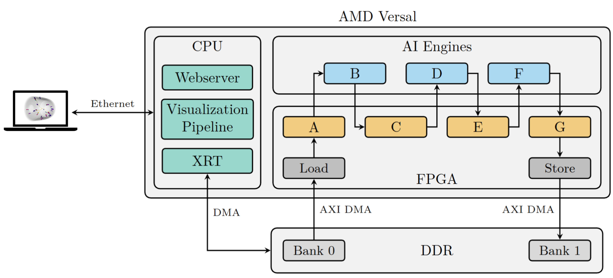
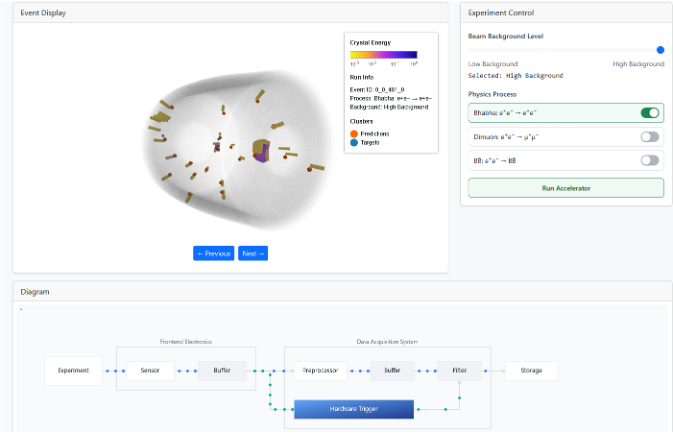

# Real-Time Graph Neural Networks for Online Event Selection in Big Science: An Interactive Demonstrator

End-to-end FPGA+AIE implementation of an optimized inference pipeline for [**CaloClusterNet**](https://arxiv.org/abs/2602.15118), a dynamic Graph Neural Network for particle collision data filtering, targeted at the **VCK190 Board**.
Includes a reusable **HLS kernel library (pcnhlslib)**, a reusable **AIE kernel library (pcnaielib)**, a **python host application** for accelerator control and a browser based **event display** for live visualization.

This repository is a submission for the FCCM Reconfigurable Computing Challenge 2026 for Team DEEP.



---

## Overview

This repository consists of three major parts:
- source code, configs and Makefiles for the accelerator as FPGA only ([baseline](./accelerator/baseline)) implementation and with FPGA + AIE ([ours](./accelerator/ours))
- [deeploy](./python/deeploy/) - a python package for loading our quantized model parameters into C-headers and simplifying data handling for system verification through simulation
- the [demonstrator](./demonstrator/) running a live visualization of accelerator predictions for different scenarios

The [model/](./model/) directory contains the trained model weights (`model_full.h5`) and configuration (`config.yaml`) used by DeePloy to generate the quantized C-headers.

Repository structure:

```
vck190-caloclusternet-demo/
├── accelerator/
│   ├── ours/
│   │   ├── src/
│   │   │   ├── aie/
│   │   │   ├── pl/
│   │   │   └── host/
│   │   ├── config/
│   │   ├── notebook/
│   │   ├── data/
│   │   └── Makefile
│   └── baseline/
│       ├── src/
│       │   ├── pl/
│       │   └── host/
│       ├── config/
│       ├── notebook/
│       ├── data/
│       └── Makefile
├── docs/
├── model/
├── demonstrator/
├── evaluation/
├── python/
├── libraries/
│   ├── pcnhlslib/
│   └── pcnaielib/
└── README.md
```

## Setup

### Installing Tools

The following tools and software must be installed on your machine to build and deploy our demonstrator:

- AMD Vivado 2024.2
- AMD Vitis 2024.2
- Python 3.12

Optional:

- Additional Board Support Packages for VCK190
- Petalinux 2024.2 SDK for the AMD VCK190

### Cloning this repository

To clone this repository run the following command in the terminal:

```bash
git clone --recurse-submodules https://github.com/marcneu/vck190-caloclusternet-demo.git
```

### Setting up a Python virtual environment

To install dependencies for our deployment framework **DeePloy** in a venv use:

```bash
python3 -m venv venv
source venv/bin/activate
pip install -r requirements.txt
pip install -e .
```

This installs the **DeePloy** package from [`python/`](./python/) along with its dependencies (numpy, pandas, h5py, PyYAML, scikit-learn, and others listed in [`requirements.txt`](./requirements.txt)). Note that `requirements.txt` pins the full development environment; a subset is sufficient for running DeePloy alone.

## Building the Accelerator Firmware

Note that all required binaries to run the accelerator are already provided in the [demonstrator/binaries/](./demonstrator/binaries/) folder.
However, a straightforward build flow is additionally provided by us to comfortably:
- load new model parameters
- build accelerators from source including compiling PL and AIE kernels, linking and packaging for deployment on an SD Card
- execute a hardware emulation for system verification

### Build FPGA baseline version

The FPGA only implementation can be built by executing steps 1-8 of [this Jupyter Notebook](./accelerator/baseline/notebook/main.ipynb).

### Build FPGA + AIE version

The FPGA + AIE implementation can be built by executing steps 1-8 of [this Jupyter Notebook](./accelerator/ours/notebook/main.ipynb).

## Performance Analysis

### Hardware Emulation Flow

To run a hardware emulation of the respective accelerator, adjust the Makefile target under `accelerator/`.
For hardware emulation, please specify the `hw_emu` target.
If you would like to start the graphical debugger, pass the additional flag `-g`.

> [!CAUTION]
> The following things must be adjusted to run our build and hardware emulation flow:
>
> - In the respective [Makefile](./accelerator/ours/firmware.mk), please adjust the flag to either hardware emulation or hardware implementation flow
> - For packaging, adjust the `package.cfg` paths for the software SDK
> - The paths in [config/aiesim_options.txt](./accelerator/ours/config/aiesim_options.txt) must be set correctly. Most importantly `AIE_PKG_DIR` in `aiesim_options.txt` must be the **absolute** path to the aie compile directory

To support AI Engine tracing, you may: 

1. Enable `--aie.event-trace=runtime`, `--aie.event-trace-port=gmio`, `--aie.num-trace-streams=8`, and `--aie-heat-map` in the Makefile
2. Set `AIE_PKG_DIR` in `aiesim_options.txt` to the **absolute** path of the aie compile directory
3. Make sure in `xrt.ini` the `tile_based_aie_metrics = all:heat_map` and `aie_trace=true` is set

To combine the results from the RTL hardware simulation for the Programmable Logic and System-C simulation for the AI Engines consider the following steps:

1. Copy all files from Hardware Emulation QEMU
2. Open the `xrt.run_summary` file
3. Insert the path to the aie compile directory
4. If you use the tracing feature, export the `aie.vcd` under the hw emulation directory into a `events.txt` using `vcdanalyze -vcd aie.vcd --pkg-dir=../../../../aie --wdb --text`
5. Add the trace to the original summary

### Hardware Flow

We compare the performance of our implementation in three optimization degrees against the baseline FPGA-only implementation.
We provide all binaries and recorded traces in the [evaluation](./evaluation/) folder to reproduce our results.
You may use the `run.sh` script to reproduce the exact command used for the evaluation.

| Implementation | Description | Latency (1 event) | Latency (1024 events) | Throughput |
|---|---|---|---|---|
| Baseline (FPGA only) | Reference implementation | 6.04 µs | 533 µs | 1.92 M events/s |
| Ours (FPGA + AIE) | Baseline partitioning | 18.05 µs | 1573 µs | 0.65 M events/s |
| Ours (FPGA + AIE) | Operator fusion and parallelization | 7.47 µs | 433.5 µs | 2.36 M events/s |
| Ours (FPGA + AIE) | Kernel-level optimizations | 7.15 µs | 347.4 µs | **2.94 M events/s** |

The baseline partitioning row establishes the FPGA+AIE partitioning and serves as the starting point for subsequent optimizations; the performance gap relative to the baseline closes with operator fusion and parallelization, and is surpassed with kernel-level optimizations.

## Testing

To test the functional correctness of our accelerator, execute the last step of the respective Jupyter Notebook ([baseline](./accelerator/baseline/notebook/main.ipynb), [ours](./accelerator/ours/notebook/main.ipynb)).
The test datasets have been generated using QKeras.
Our accelerator results match 100% against their offline counterpart.

## Running the Interactive Demonstrator

### Preparing the SD Card for the AMD VCK190

We also provide a full SD Card image including the binaries and python scripts for the webserver [here](https://bwsyncandshare.kit.edu/s/Nj5nCXHLEGBpCe5).
Your SD Card must have at least 32GB storage.

If you would like to build the image yourself, you can start by downloading the official **Common Petalinux image 2024.2 for VCK190** from [here](https://www.xilinx.com/support/download/index.html/content/xilinx/en/downloadNav/embedded-platforms/2024-2.html).
Using the Petalinux SDK, you can build an accelerator from `accelerator/` and use `make package` to generate the modified boot partition.

In the following we assume you are using our prebuilt device image.

### Standalone Inference on the VCK190

To run inference directly on the board without the web server, use the standalone script from `/home/petalinux/server`:

```bash
cd /home/petalinux/server
python3 standalone.py binaries/accelerator.xclbin data/input.h5 output.h5 --num-events 1024
```

### Running the demonstrator

Our prebuilt SD card image already contains a copy of the files under the [demonstrator](./demonstrator/) directory at `/home/petalinux/server`.
To start the webserver, you may call:

```bash
cd /home/petalinux/server
python3 main.py
```

The interactive web application can be accessed via web browser from `http://versal-vck190:8081`.



The web interface consists of three panels: an **event display** (left) showing a 3D rendering of the calorimeter crystals with cluster predictions overlaid, an **experiment control** panel (right), and a **data flow diagram** (bottom) visualizing the accelerator pipeline.

The experiment control panel offers two settings:

- **Beam Background Level**: selects between *Low Background* (nominal beam conditions) and *High Background* (elevated beam-induced background).
- **Physics Process**: selects one of three collision types — *Bhabha* (e⁺e⁻ → e⁺e⁻), *Dimuon* (e⁺e⁻ → μ⁺μ⁻), or *BB̄* (e⁺e⁻ → BB̄).

Pressing **Run Accelerator** sends the selected dataset to the VCK190, runs inference, and updates the event display and the animated pipeline diagram.

*Note: By default the Versal VCK190 Board requests an IP address from the network DHCP server. In case you do not know the IP address, you might have to connect to the board via serial. The image uses the default Petalinux passwords. Do not connect this demonstrator to a public network!*

## Contributors

- [Marc Neu](mailto:marc.neu@kit.edu)
- [Thomas Gideon Lobmaier](mailto:thomas.lobmaier@student.kit.edu)
- [Frank Michael Baptist](mailto:frank.baptist@student.kit.edu)
- [Fabio Papagno](mailto:uwokr@student.kit.edu)

## License

This project is licensed under the MIT License — see the [LICENSE](./LICENSE) file for details.
